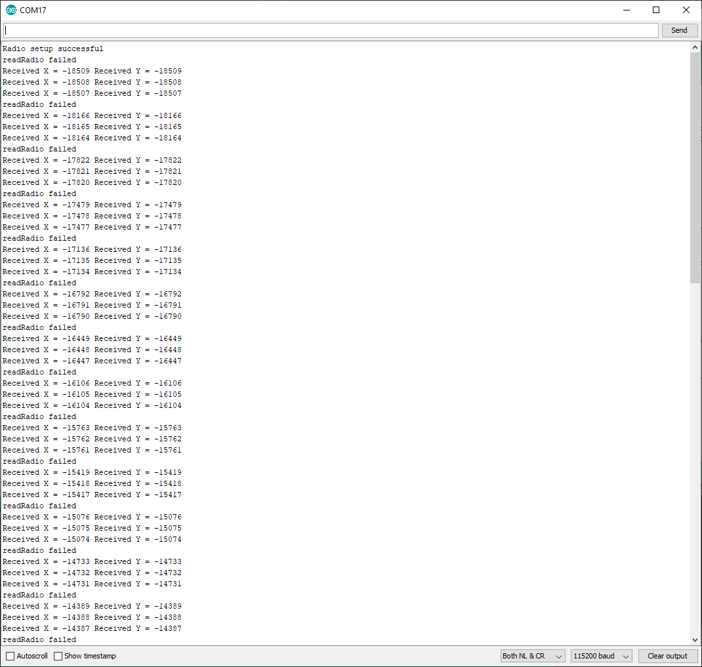
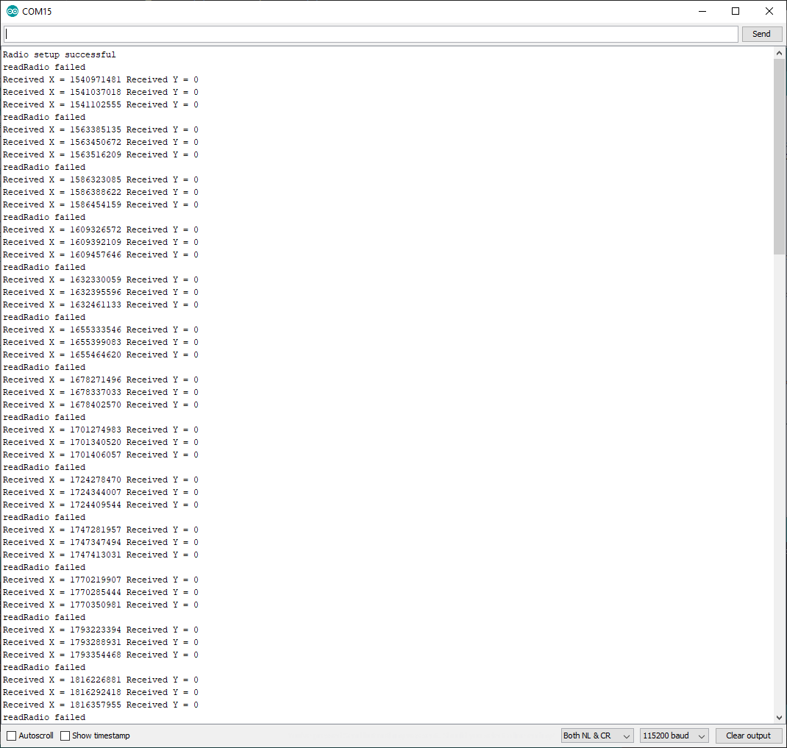

# Help
I'm trying to get an Arduino Nano and an Adafruit Feather nRF52832 to communicate via two NRF24L01 radio modules.  Ultimately the nano will send accelerometer data to the feather which will then move a cursor on an android tablet via bluetooth.  I've tried to use the nRF24 library located here https://github.com/nRF24/RF24 and was receiving garbage data.  Thinking it was the library (when compiling it said it wasn't supported on the nRF52832) I searched for a different library and found the Radiohead library located here https://www.airspayce.com/mikem/arduino/RadioHead/.  Radiohead says it is compatible with the nRF52 chip, even specifically calls out the nRF52832.  

The included code works when I use two nanos, but when I replace one of the nanos with the nRF52832 the returned data is corrupt as you can see in the two screenshots.  

Any help would be appreciated. 

Note:  I do change the CE and CSN pin in the RadioSetup.h file to suit either the feather or the nano.  I only uploaded one copy as an example.  
